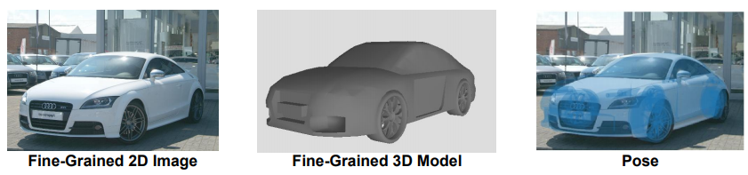

# 3D Pose Annotation for Fine-Grained Object Categories

  

## Contents of Directories

- Anno3D: 3D pose annotations for StanfordCars/FGVC_Aircraft/CompCars
- CAD: Sample CAD models from ShapeNet for visualization use; list of CAD models used in our datasets
- Image: Sample images from the fine-grained datasets for visualization use
- Scripts: Sample scripts to visualize the annotations

## Format of Annotations
The annotations are packed in pickle (.pkl) files, each of which include a dictionary of annotations, 

`dict[key] = anno`,

where `key` is the filename, and `anno` is a dictionary containing the following fields:
- `model_id`: the corresponding fine-grained 3D CAD model ID from ShapeNet
- `azimuth, elevation, theta`: the rotation angles introduced in Section 3.2 of the paper
- `distance`: the parameter 'd' introduced in Section 3.2 of the paper
- `u, v`: the principal point (u, v) introduced in Equation (3) 
- `f`: the focal length f in Equation (3)

## Usage
To use the 3D pose annotations, you need to download the 2D images from the fine-grained recognition datasets as well as the
3D models from the ShapeNet dataset.

### 1. Download 2D Images

#### (1) StanfordCars:
http://imagenet.stanford.edu/internal/car196/cars_train.tgz

http://imagenet.stanford.edu/internal/car196/cars_test.tgz

After downloading, put the extracted directory `cars_train` and `cars_test` under `Image/StanfordCars`.

#### (2) FGVC_Aircraft:
http://www.robots.ox.ac.uk/~vgg/data/fgvc-aircraft/archives/fgvc-aircraft-2013b.tar.gz

After downloading, put the extracted directory `fgvc-aircraft-2013b/data/images` under `Image/FGVC_Aircraft`.

#### (3) CompCars:
https://www.dropbox.com/sh/46de2cre37fvzu6/AABXtX8QqA6sx37k1IyZmNQ2a?dl=0

Please contact the data provider of CompCars (yljatthu@gmail.com) for the extraction password.
After downloading, put the extracted directory `data/image` under `Image/CompCars`.

### 2. Download 3D CAD Models

#### (1) Cars (For StanfordCars/CompCars Use)
http://shapenet.cs.stanford.edu/shapenet/obj-zip/ShapeNetCore.v1/02958343.zip

After downloading, put the extracted `02958343` under CAD/
Please see `CAD/StanfordCars3D.txt` and `CAD/CompCars3D.txt` for the list of CAD models used in our 3D pose datasets.

#### (2) Aircraft (For FGVC_Aircraft Use)
http://shapenet.cs.stanford.edu/shapenet/obj-zip/ShapeNetCore.v1/02691156.zip

After downloading, put the extracted `02691156` under CAD/
Please see `CAD/FGVC_Aircraft3D.txt` for the list of CAD models used in our 3D pose datasets.

## Visualization and Scripts
To visualize the samples, run
`cd Scripts && bash ./sample_visualize.sh`

The usage of our annotations can be seen from the following python scripts,
- `utils.py`: containing the code for projection as well as converting the angles to rotation matrix and a simple .obj file
reader
- `sample_visualize.py`: containing the code for visualization

## Publications
- [3D Pose Estimation for Fine-Grained
Object Categories](http://openaccess.thecvf.com/content_ECCVW_2018/papers/11129/Wang_3D_Pose_Estimation_for_Fine-Grained_Object_Categories_ECCVW_2018_paper.pdf)
- [Improving Annotation for 3D Pose Dataset of Fine-Grained Object Categories](https://arxiv.org/pdf/1810.09263.pdf)

## Citation
Please cite the paper in your publications if it helps your research:

    @inproceedings{wang20183d,
      title={3d pose estimation for fine-grained object categories},
      author={Wang, Yaming and Tan, Xiao and Yang, Yi and Liu, Xiao and Ding, Errui and Zhou, Feng and Davis, Larry S},
      booktitle={Proceedings of the European Conference on Computer Vision (ECCV)},
      pages={0--0},
      year={2018}
    }

    @article{wang2018improving,
      title={Improving Annotation for 3D Pose Dataset of Fine-Grained Object Categories},
      author={Wang, Yaming and Tan, Xiao and Yang, Yi and Li, Ziyu and Liu, Xiao and Zhou, Feng and Davis, Larry S},
      journal={arXiv preprint arXiv:1810.09263},
      year={2018}
    }
